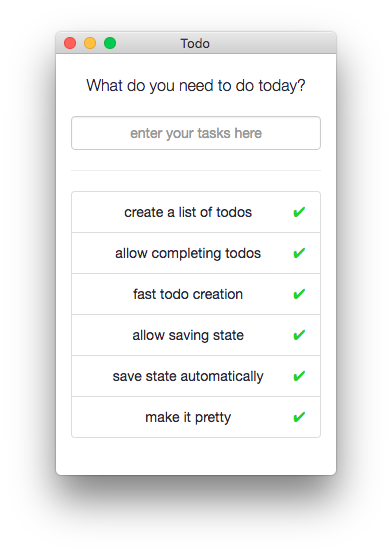

# todo
A minimal todo app built on Electron



## Installation
Clone down the repository into a new directory
```
git clone https://github.com/thewildandy/todo.git .
cd todo
```

Install dependencies via NPM and Bower
```
npm install
bower install
```

Spin up the app via Electron
```
electron .
```
